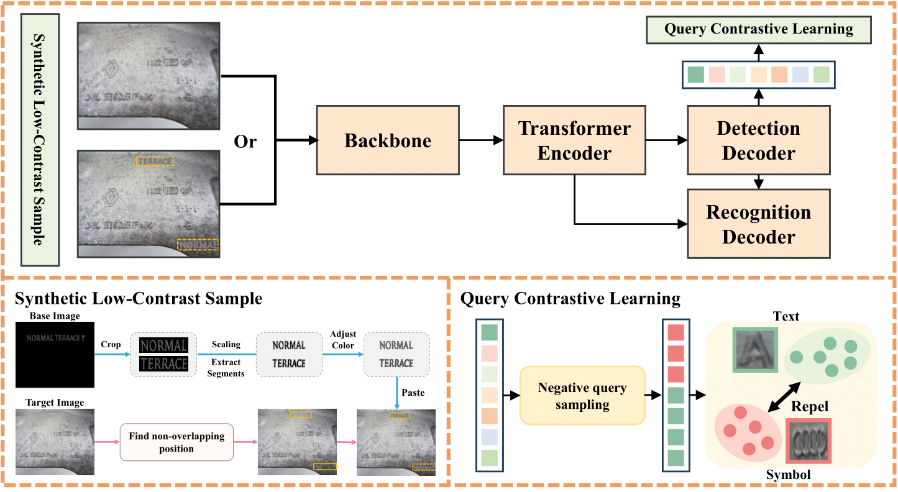

# ContraText-DETR: Boosting Industrial Scene Text Detection based on Contrastive Learning and Synthetic Low-Contrast Text

## Official Pytorch Implementation of [ContraText-DETR: Boosting Industrial Scene Text Detection based on Contrastive Learning and Synthetic Low-Contrast Text](https://ieeexplore.ieee.org/document/11062481)

---
<div align="center">
  
</div>

> **ContraText-DETR: Boosting Industrial Scene Text Detection based on Contrastive Learning and Synthetic Low-Contrast Text**<br>
> Yunseo Jeong, Seokjun Kwon, Jeongmin Shin, and Yukyung Choi† (Sejong Univ.) 
> 
>
> **Abstract:** *Scene text detection in industrial environments is challenging due to low-contrast, corrosion, and glare on metallic surfaces, which affect detection accuracy. Furthermore, symbols such as engraved logos resemble text, leading to misclassification and increased false positive rates. In this study, we propose a framework that applies synthetic data augmentation to handle low-contrast conditions and employs contrastive learning to enhance text-symbol differentiation. This framework improves robustness and generalization by training the model to diverse low-contrast scenarios. Furthermore, it reduces misclassification by using false positives as negative samples, enhancing the separation between text and symbols. Since the proposed method is adopted only during the training phase, it avoids computational overhead during inference. Moreover, it does not rely on modifications to the architecture, allowing flexible integration into existing text detectors. In addition, we observed ambiguities in the annotation criteria of the MPSC dataset, particularly in distinguishing individual text instances and labeling their ground-truth bounding boxes. To resolve this, we re-annotate the dataset by defining a consistent standard for text instance labeling. Our experimental results demonstrate that the proposed model achieves state-of-the-art performance on the MPSC dataset, validating its applicability to industrial text detection tasks.*

---

## 🔧 Updates
* [Current] Initial code release
* [TODO] Will release checkpoints.
  
---

## 📦 Installation

### Recommended Environment
- **OS:** Ubuntu 18.04
- **CUDA:** 11.1
- **Python:** 3.8
- **PyTorch:** 1.9.1 + cu111
- **GPU:** NVIDIA RTX 3090

### Setup Instructions
```
conda create -n ContraText-DETR python=3.8 -y
conda activate ContraText-DETR
pip install torch==1.9.1+cu111 torchvision==0.10.1+cu111 -f https://download.pytorch.org/whl/torch_stable.html
python -m pip install detectron2 -f https://dl.fbaipublicfiles.com/detectron2/wheels/cu111/torch1.9/index.html
pip install --upgrade "numba<0.54"
pip install scikit-image==0.19.3 shapely rapidfuzz==2.15.1 timm albumentations
pip install pillow==9.5.0
pip install setuptools==59.5.0.
pip install numpy==1.23.2
pip install charset-normalizer==2.0.6 requests
git clone https://github.com/yunseoooo/ContraText-DETR.git
cd ContraText-DETR
python setup.py build develop --user
```

### 📁 Data Preparation

>**SynText150K, TotalText, CTW1500:**  [AdelaiDet](https://github.com/aim-uofa/AdelaiDet/tree/master/datasets) 
>
>**MPSC**: [OneDrive](https://drive.google.com/file/d/1R261-ODHur6YDodoHXABSU6MUKPTq-86/view?usp=sharing)
>

The directory structure after processing should be as follows.
```
|- datasets
   |- syntext1
   |  |- train_images
   |  └─ train_poly_pos.json  # "pos" denotes the positional label form
   |- syntext2
   |  |- train_images
   |  └─ train_poly_pos.json
   |- MPSC
   |  |- image
   |  |   |-train
   |  |   └─ test
   |  └─ annotation
   |      |-train
   |      |-test
   |      |-train.json
   |      |-test.json
   |      |-bbox_distribution.json
   |      └─ train_with_symbol.json
   |- TextSeg
   |  |- image
   |  └─ annotation
   |- evaluation
   |  |- lexicons
   |  └─ gt_mpsc.zip
```

## 🏃‍♀️🏃 Run
### Training

**1. Pre-training:**
To pre-train the model, use the following configuration:
```
python tools/train_net.py --config-file configs/ContraText_DETR/Pretrain/R_50_poly.yaml --num-gpus 4
```

**2. Fine-tuning on MPSC:**
To fine-tune the pre-trained model specifically on the MPSC dataset, run the command below.
```
python tools/train_net.py --config-file configs/ContraText_DETR/MPSC/R_50.yaml --num-gpus 4
```

### Evaluation
```
python tools/train_net.py --config-file ${CONFIG_FILE} --eval-only MODEL.WEIGHTS ${MODEL_PATH}
```

## 📚 Acknowledgments:
We referenced the repos below for the code. Thanks for their awesome work! 🔥
* [DPText-DETR](https://github.com/ymy-k/DPText-DETR/tree/main)

